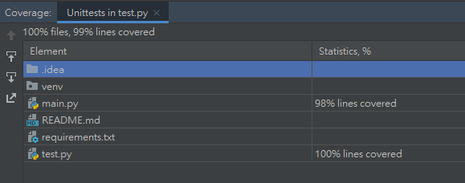

# Interview Test

## outline
1. [題目說明](#題目說明)
2. [程式講解](#程式講解)
3. [UnitTest說明](#unittest說明)

## 題目說明
```
Please use Python 3 to answer question
Welcome to answer with unit testing code if you can
 
After you finish coding, please push to your GitHub account and share the link with us.
```
- example:
```
# Input:
input_value = {
  'hired': {
    'be': {
      'to': {
        'deserve': 'I'
      }
    }
  }
}
 
# Output:
output_value = {
  'I': {
    'deserve': {
      'to': {
         'be': 'hired'
      }
    }
  }
}
```

## 程式講解
- 使用兩種方式進行撰寫
    1. 先把dictionary轉成list，再透過list for loop組成dictionary
    2. 先把dictionary轉成list，再透過list遞迴組成dictionary
1. 先把dictionary轉成list
    - input: {"a": {"b": "c"}} => output: {"c": {"b": "a"}}
```python
def reversed_dict(input_dict: Union[Dict[str, Dict], Dict[str, str]]) -> List[str]:
    """
    reversed dictionary, ex: input: {"a": {"b": "c"}} => output: ["a", "b", "c"]
    :param input_dict:
    :return:
    """
    result = []
    if not isinstance(input_dict, dict):
        return []
    next_key = input_dict.keys()
    next_value = input_dict.values()

    while next_key:
        result.append(list(next_key)[0])
        temp_dict = list(next_value)[0]

        if isinstance(temp_dict, str):
            next_key = None
            result.append(temp_dict)
        else:
            next_key = temp_dict.keys()
            next_value = temp_dict.values()

    return result
```

2. 再透過list for loop組成dictionary
    - ["a", "b", "c"] => output: {"c": {"b": "a"}}
```python
def second_reversed_dict(input_dict: Union[Dict[str, Dict], Dict[str, str]]) -> Union[Dict[str, Dict], List]:
    """
    reversed dictionary, ex: input: {"a": {"b": "c"}} => output: {"c": {"b": "a"}}
    :param input_dict:
    :return:
    """
    result = reversed_dict(input_dict)

    if result:
        ans = result[0]
        for i in range(1, len(result)):
            temp_dict = {result[i]: ans}
            ans = temp_dict
        return ans
    else:
        return result
```

3. 再透過list遞迴組成dictionary
    - input: ["a", "b", "c"] => output: {"c": {"b": "a"}}
```python
def compose_dict(input_list: Optional[List[str]]) -> Union[Dict[str, Dict], str]:
    """
    compose dictionary, ex: input: ["a", "b", "c"] => output: {"c": {"b": "a"}}
    :param input_list:
    :return:
    """
    if not isinstance(input_list, list):
        return ""

    if len(input_list) == 1:
        return input_list[0]
    else:
        value = input_list.pop(0)
        return {value: compose_dict(input_list)}
```

## unittest說明
- 
- 主要進行簡單的測試
    1. 輸入正常資料(單、多 dictionary)
    2. 輸入空值
    3. 輸入錯誤格式
